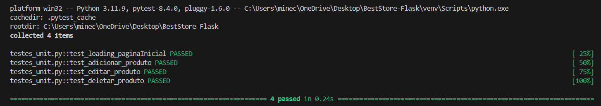

# Teste - BestStoreMVC

## Definição da aplicação web a ser testada

O **BestStoreMVC** é uma aplicação web desenvolvida com Blazor e .NET 9 para gerenciamento eficiente de produtos. Ele oferece uma interface moderna e responsiva para facilitar a criação, edição, visualização e exclusão de itens.

**Estrutura da Página**
A aplicação é organizada de forma intuitiva para proporcionar uma boa experiência ao usuário. Entre os principais elementos da página, estão:

- **Cadastro de Produtos:** Interface para adicionar novos produtos, incluindo informações como nome, marca, categoria, preço e descrição.

- **Edição e Exclusão:** Funcionalidade que permite modificar ou remover produtos diretamente da página de gerenciamento.

- **Validação de Formulário:** Implementação de validações visuais para garantir a integridade dos dados inseridos.

- **Design Responsivo:** Construído com Bootstrap, garantindo compatibilidade com diversos dispositivos, desde desktops até smartphones.

- **Navegação Intuitiva:** Estrutura bem definida para facilitar a interação dos usuários com os recursos disponíveis.
## Lista dos principais fluxos de interação a serem validados:

#### **Cadastro de Produtos**

1. Inserção de novos produtos no banco de dados.

2. Validação de dados obrigatórios e formatos corretos.

#### **Exibição de Produtos**

Apresentação correta das informações dos produtos cadastrados.

1. Funcionamento da paginação e carregamento dinâmico.

#### **Edição de Produtos**

1. Alteração de informações do produto e persistência das mudanças.

2. Tratamento de erros ao inserir valores inválidos.

#### **Exclusão de Produtos**

1. Remoção do produto do banco de dados sem deixar registros inválidos.

2. Confirmação de exclusão antes de deletar um item.

3. Garantia de que a remoção não afeta negativamente outros elementos da aplicação.

#### **Validação de Dados e Interface**

1. Exibição de mensagens de erro e feedback ao usuário.

2. Comportamento correto dos botões de ação (salvar, editar, excluir).

**********************************************************************************************************************************************

<h1 align="center">Tabela de Decisão: Teste_Cadastro_Novo_Produto</h1>

| **Condição**              | **Regra 1** | **Regra 2**                                      | **Regra 3**                                         | **Regra 4**                                      | **Regra 5**                                           |
|--------------------------|-------------|--------------------------------------------------|-----------------------------------------------------|--------------------------------------------------|--------------------------------------------------------|
| Nome preenchido          | SIM         | NÃO                                              | SIM                                                 | SIM                                              | SIM                                                    |
| Descrição preenchida     | SIM         | SIM                                              | NÃO                                                 | SIM                                              | SIM                                                    |
| Preço preenchido         | SIM         | SIM                                              | SIM                                                 | NÃO                                              | SIM                                                    |
| Quantidade preenchida    | SIM         | SIM                                              | SIM                                                 | SIM                                              | NÃO                                                    |
| **Ação esperada**        | Produto adicionado com sucesso!  | Erro: "Preencha este campo."              | Produto adicionado com sucesso!           | Erro: "Preencha este campo."            | Erro: "Preencha este campo."              |

## Observações sobre a Tabela de Decisão

Pode-se concluir que, **caso qualquer uma das propriedades obrigatórias do produto não seja preenchida, o cadastro não será efetuado com sucesso**.

### Pontos de Atenção:
- O campo **preço é obrigatório**, e sua ausência impede o cadastro.
- Contudo, o sistema **aceita o valor zero (0)** como um preço válido.  
  Isso levanta a seguinte questão: **esse comportamento é realmente desejado?**  
  Em muitos contextos, um produto com preço igual a zero pode representar uma falha de entrada ou indicar a necessidade de uma validação adicional.

  ***********************************************************************************************************************************************************************************

## ✅ Casos de Teste - Criação de Produto

### 🔹 Caso de Teste 1 – Criação bem-sucedida
**Objetivo**: Verificar se o sistema permite a criação de um produto quando todos os campos obrigatórios são devidamente preenchidos.

**Pré-condições**: Usuário autenticado com permissão para cadastrar produtos.

**Entradas**:
- Nome: preenchido
- Descrição: preenchida
- Preço: preenchido
- Quantidade: preenchida

**Passos**:
1. Acessar a tela de cadastro de produto.
2. Preencher todos os campos obrigatórios com dados válidos.
3. Clicar no botão "Salvar".

**Resultado Esperado**: Produto criado com sucesso. Mensagem de confirmação exibida.

---

### 🔹 Caso de Teste 2 – Falha por campo obrigatório não preenchido
**Objetivo**: Verificar se o sistema bloqueia a criação de um produto quando qualquer campo obrigatório está vazio ou inválido.

**Pré-condições**: Usuário autenticado com permissão para cadastrar produtos.

**Entradas (exemplos de falha)**:
- Nome: vazio **ou**
- Descrição: preenchida **ou** vazia (permitido) **ou**
- Preço: vazio/inválido **ou**
- Quantidade: vazia

**Passos**:
1. Acessar a tela de cadastro de produto.
2. Deixar um ou mais campos obrigatórios vazios ou inválidos.
3. Clicar no botão "Salvar".

**Resultado Esperado**: Produto não é criado. O sistema exibe uma mensagem de erro - "Preencha este campo." - abaixo do campo correspondente.

**Exceção:** o campo "Descrição" não é obrigatório, portanto, mesmo se estiver vazio não impedirá a adição do produto.

   
---

<h1 align="center"> Teste_Edição_Produto</h1>

| **Condição**              | **Regra 1** | **Regra 2**                                      | **Regra 3**                                         | **Regra 4**                                      | **Regra 5**                                           |
|--------------------------|-------------|--------------------------------------------------|-----------------------------------------------------|--------------------------------------------------|--------------------------------------------------------|
| Nome editado ≠ vazio         | SIM         | NÃO                                              | SIM                                                 | SIM                                              | SIM                                                    |
| Descrição editada e/ou =vazio    | SIM         | SIM                                              | NÃO                                                 | SIM                                              | SIM                                                    |
| Preço editado ≠ vazio        | SIM         | SIM                                              | SIM                                                 | NÃO                                              | SIM                                                    |
| Quantidade editada ≠ vazio   | SIM         | SIM                                              | SIM                                                 | SIM                                              | NÃO                                                    |
| **Ação esperada**        | Produto atualizado com sucesso!  | Erro: "Preencha este campo."              | Produto atualizado com sucesso!           | Erro: "Preencha este campo."            | Erro: "Preencha este campo."              |

## ✅ Casos de Teste – Edição de Produto

### 🔹 Caso de Teste 1 – Edição bem-sucedida
**Objetivo**: Verificar se o sistema permite editar um produto quando todos os campos obrigatórios são preenchidos corretamente.

**Pré-condições**: Produto existente no sistema.

**Entradas**:  
- Todos os campos preenchidos e selecionados

**Passos**:
1. Acessar o formulário de edição do produto.
2. Editar os campos com valores válidos.
3. Clicar no botão "Atualizar".

**Resultado Esperado**: Produto atualizado com sucesso. Mensagem de confirmação exibida.

---

### 🔹 Caso de Teste 2 – Falha por campo obrigatório não preenchido
**Objetivo**: Verificar se o sistema bloqueia a edição de um produto quando qualquer campo obrigatório está vazio ou inválido.

**Pré-condições**: Produto existente no sistema.

**Entradas (exemplos de falha)**:
- Nome: vazio **ou**
- Descrição: preenchida **ou** vazia (permitido) **ou**
- Preço: vazio/inválido **ou**
- Quantidade: vazia

**Passos**:
1. Acessar a tela de edição de produto.
2. Deixar um ou mais campos obrigatórios vazios ou inválidos.
3. Clicar no botão "Atualizar".

**Resultado Esperado**: Produto não é editado. O sistema exibe uma mensagem de erro - "Preencha este campo." - abaixo do campo correspondente.

**Exceção:** o campo "Descrição" não é obrigatório, portanto, mesmo se estiver vazio não impedirá a edição do produto.
   
---
<h1 align="center">Teste_Exclusao_Produto</h1>

| condição                 | Regra 1          | Regra 2              |
|-------------------------|------------------|-----------------------|
| confirmação de exclusão | SIM              | NÃO                   | 
| cancelamento de exclusão| NÃO              | SIM                   | 
| ação esperada           | Produto deletado com sucesso! | Produto não deletado  | 

## ✅Casos de Teste – Exclusão de Produto

### 🔸 Caso de Teste 1 – Confirmação de Exclusão
**Objetivo**: Verificar se o sistema remove corretamente um produto após a confirmação do usuário.

**Pré-condições**: Produto existente no sistema.

**Entradas**:  
- Produto a ser excluído

**Passos**:
1. Clicar no ícone de lixeira - Deletar -  do produto.
2. Confirmar a exclusão na janela/modal de confirmação.

**Resultado Esperado**: Produto deletado com sucesso. Mensagem de confirmação exibida.

---

### 🔸 Caso de Teste 2 – Cancelamento da Exclusão
**Objetivo**: Verificar se o sistema mantém o produto quando a exclusão é cancelada.

**Pré-condições**: Produto existente no sistema.

**Entradas**:  
- Produto a ser excluído

**Passos**:
1. Clicar no ícone de lixeira - Deletar -  do produto.
2. Na janela/modal de confirmação, clicar em "Cancelar".

**Resultado Esperado**: Produto não é deletado. Nenhuma alteração é feita. O usuário permanece na mesma tela.\

---

## Prints dos logs de execução

### ➕ Adicionando um produto

### ✏ Editando um produto

### 🗑 Deletando um produto

### ✅ Testes Unitários

