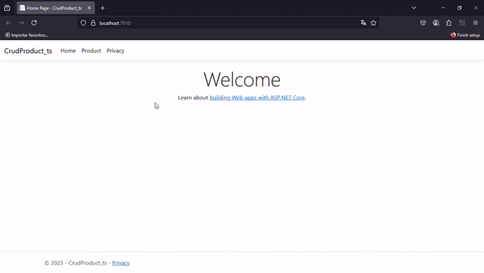

# Teste - BestStoreMVC

## Definição da aplicação web a ser testada

O **BestStoreMVC** é uma aplicação web desenvolvida com Blazor e .NET 9 para gerenciamento eficiente de produtos. Ele oferece uma interface moderna e responsiva para facilitar a criação, edição, visualização e exclusão de itens.

**Estrutura da Página**
A aplicação é organizada de forma intuitiva para proporcionar uma boa experiência ao usuário. Entre os principais elementos da página, estão:

- **Cadastro de Produtos:** Interface para adicionar novos produtos, incluindo informações como nome, marca, categoria, preço e descrição.

- **Edição e Exclusão:** Funcionalidade que permite modificar ou remover produtos diretamente da página de gerenciamento.

- **Validação de Formulário:** Implementação de validações visuais para garantir a integridade dos dados inseridos.

- **Design Responsivo:** Construído com Bootstrap, garantindo compatibilidade com diversos dispositivos, desde desktops até smartphones.

- **Navegação Intuitiva:** Estrutura bem definida para facilitar a interação dos usuários com os recursos disponíveis.
## Lista dos principais fluxos de interação a serem validados:

#### **Cadastro de Produtos**

1. Inserção de novos produtos no banco de dados.

2. Validação de dados obrigatórios e formatos corretos.

#### **Exibição de Produtos**

Apresentação correta das informações dos produtos cadastrados.

1. Funcionamento da paginação e carregamento dinâmico.

#### **Edição de Produtos**

1. Alteração de informações do produto e persistência das mudanças.

2. Tratamento de erros ao inserir valores inválidos.

#### **Exclusão de Produtos**

1. Remoção do produto do banco de dados sem deixar registros inválidos.

2. Confirmação de exclusão antes de deletar um item.

3. Garantia de que a remoção não afeta negativamente outros elementos da aplicação.

#### **Validação de Dados e Interface**

1. Exibição de mensagens de erro e feedback ao usuário.

2. Comportamento correto dos botões de ação (salvar, editar, excluir).

**********************************************************************************************************************************************

<h1 align="center">Teste_Cadastro_Novo_Produto</h1>

| Condição               | Regra 1   | Regra 2                                           | Regra 3                                           | Regra 4                                           | Regra 5                                                |
|------------------------|-----------|---------------------------------------------------|---------------------------------------------------|---------------------------------------------------|----------------------------------------------------------|
| nome preenchido        | SIM       | NÃO                                               | SIM                                               | SIM                                               | SIM                                                      |
| marca preenchida       | SIM       | SIM                                               | NÃO                                               | SIM                                               | SIM                                                      |
| categoria selecionada  | SIM       | SIM                                               | SIM                                               | SIM                                               | SIM                                                      |
| preço preenchido       | SIM       | SIM                                               | SIM                                               | NÃO                                               | SIM                                                      |
| descrição preenchida   | SIM       | SIM                                               | SIM                                               | SIM                                               | NÃO                                                      |
| **ação esperada**      | Criação OK | Mensagem de erro ("O campo Nome é obrigatório.") | Mensagem de erro ("O campo Marca é obrigatório.") | Mensagem de erro ("O valor '' é inválido.")       | Mensagem de erro ("O campo Descrição é obrigatório.")    |

## Observações sobre a Tabela de Decisão

Pode-se concluir que, **caso qualquer uma das propriedades obrigatórias do produto não seja preenchida, o cadastro não será efetuado com sucesso**.

Em relação à categoria, **não foi realizado um teste com esse campo vazio porque o sistema oferece uma lista fechada de opções predefinidas (como "Phones", "Computers", "Accessories" e "Outros")**. Portanto, **a categoria sempre estará preenchida por padrão, não sendo possível deixá-la em branco**.

### Pontos de Atenção:
- O campo **preço é obrigatório**, e sua ausência impede o cadastro.
- Contudo, o sistema **aceita o valor zero (0)** como um preço válido.  
  Isso levanta a seguinte questão: **esse comportamento é realmente desejado?**  
  Em muitos contextos, um produto com preço igual a zero pode representar uma falha de entrada ou indicar a necessidade de uma validação adicional.

